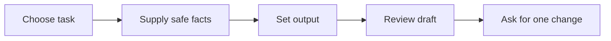

# Build a prompt with useful context

**Allow 4 minutes, including any practice below.**

## Use five parts

A useful work prompt tells ChatGPT what to do and what it has to work with.

| Part | Example from our fictional Christchurch builder |
| --- | --- |
| Task | Draft a cover email for a quote |
| Context | The customer asked about a small deck repair |
| Role and audience | Write as an office administrator to a homeowner |
| Source facts | A site visit is needed before scope is confirmed |
| Output and limits | Under 120 words; no invented price or start date |

A role helps set perspective and tone. It does not supply missing facts or professional authority.

## Compare before and after

**Before:** “Write a good quote email.”

That leaves the audience, scope, and promises unclear.

**After:**

```text
Act as an office administrator for a fictional Christchurch builder.
Draft a friendly cover email to a homeowner about a deck repair quote.
Facts: We need a site visit before confirming the scope.
We have not agreed on a price or start date.
Ask the homeowner to suggest two times for a visit.
Use NZ English. Keep it under 120 words.
Do not invent a price, date, warranty, or scope of work.
```

## Give a small example

When tone matters, include a sentence you like:

```text
Match this tone: “Thanks for getting in touch. We can help you
work through the next step.” Do not copy extra facts into the email.
```

This gives a clearer target than “make it professional”.



**Try it:** Write one prompt with these five parts. Use supplied fictional facts. Circle any detail ChatGPT would have to guess, then add that detail or ask it to flag it as unknown.
