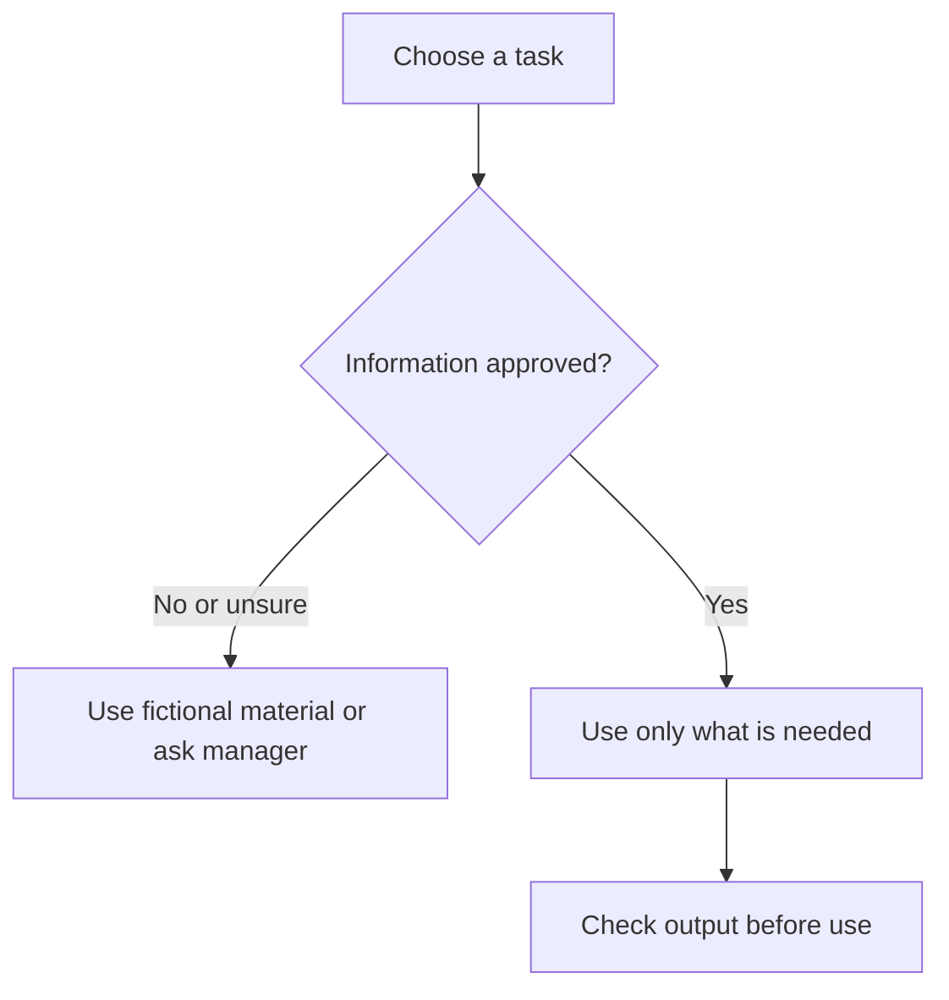

# Protect personal and confidential information

Allow 4 minutes, including any practice below.

## Apply New Zealand privacy rules

The **Privacy Act 2020** applies when organisations collect, use, or share personal information. Information can identify someone even when you remove their name.

The Privacy Commissioner's AI guidance expects organisations to assess privacy risks before using AI. Involve your privacy officer or responsible manager. A privacy impact assessment helps you decide which uses and data are suitable.

Check the purpose, transparency, security, accuracy, retention, and any overseas handling. A paid plan or a training opt-out does not remove these duties.

## Use this course's cautious rule

Never paste passwords, access tokens, or authentication codes. Do not use real client files, staff records, health details, bank details, identity documents, or confidential contracts in course exercises.

| Example input | Beginner practice choice |
| --- | --- |
| A fictional office notice | Use it |
| A public process document with no personal details | Check approval, then use only what is needed |
| A staff performance review | Keep it out of the practice chat |
| A quote with customer address and private pricing | Replace it with a fully invented example |

Removing a name is not enough. A job title, exact date, location, or unusual event can still identify a person. Invent a new scenario rather than lightly editing a sensitive one.

## Decide before you paste

If something sensitive has already been entered, stop that workflow and tell the responsible manager or privacy officer promptly. Follow your organisation's incident process. Do not assume deleting the chat resolves the incident.

Checkpoint: Choose a real task without copying its data. Write a fictional replacement you could safely use to practise the task.

## Official sources

- [Privacy Commissioner: AI and the privacy principles](https://www.privacy.org.nz/assets/New-order/Resources-/Publications/Guidance-resources/AI-Guidance-Resources-/AI-and-the-Information-Privacy-Principles.pdf)
