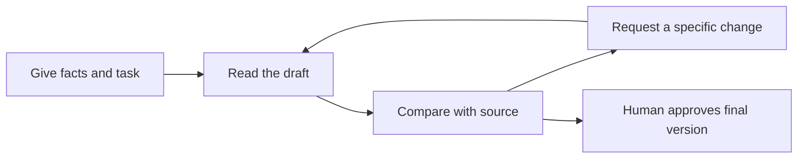

# Improve a draft one step at a time

Allow 3 minutes.

Use follow-up messages to revise a response. State what should change and what must stay.

## Make a specific revision

For the builder's email, try:

```text
Shorten the body to 60 words.
Keep the site visit and quote review facts.
Use a direct, friendly tone. Keep the subject line.
Do not add a price or a delivery date.
```

If a response says, "Your quote will arrive on Friday," correct it: "Friday was not in my notes. Remove the deadline and check for other added facts."

## Use a review loop



Keep useful instructions in your own prompt library. Save the task, the safe input pattern, and the checks you used. Leave personal information out.

## Try it: two edits

Revise your practice email for length, then for tone. Compare the final result with the original facts. Check that neither edit adds a date or price.
