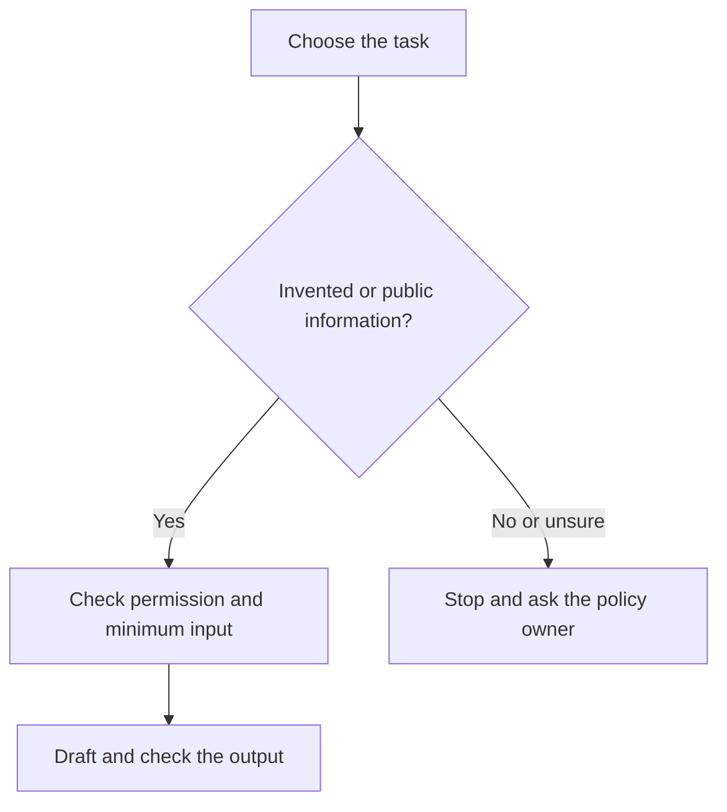

# Protect information before it enters Claude

Allow 4 minutes.

The Privacy Act 2020 applies when a NZ organisation handles personal information, including through AI. Personal information can identify someone through a combination of details even if you remove their name.

The Privacy Commissioner expects organisations to assess privacy impacts before using AI. Confirm approval, what information is necessary, and how the provider will handle it. A training opt-out alone does not settle those questions.

## Keep these out of practice chats

Do not paste passwords, access tokens, client tax records, bank details, employee health or performance records, confidential contracts, or commercially sensitive quotes. Use the invented examples in this course.

**Illustrative example:** Removing a name from a note about “the only payroll officer in our three-person Hamilton office” may still identify that person. Replace the whole situation with a made-up one.

## Make the input decision first

## Try it: prepare a safe input

List the types of information in a task you do often. Do not copy the actual information. Mark which types could identify a person or expose business secrets. Create a fully invented practice version.

If real information is needed later, ask your privacy officer or policy owner to assess the use first, including storage and overseas handling. Follow the employer's incident process if private information is entered by mistake.

## Sources

Checked 7 October 2026. [Privacy](https://www.privacy.org.nz/assets/New-order/Resources-/Publications/Guidance-resources/AI-Guidance-Resources-/AI-and-the-Information-Privacy-Principles.pdf).
