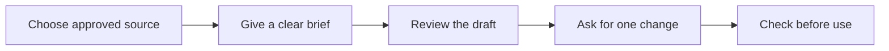

# Give Copilot a clear brief

Allow 4 minutes. A prompt is the instruction you give Copilot. A useful brief says what to do and what to use.

Microsoft's prompt guidance uses four ingredients: goal, context, source and expectations. Add a role or an example when it helps the task. A role can guide tone; it does not give Copilot professional authority.

## Build a brief you can reuse

| Ingredient | Your instruction |
| --- | --- |
| Goal | Draft a staff reminder. |
| Context | You are helping an office administrator in Hamilton. Readers are busy staff. |
| Source | Use only the notes I provide below. |
| Expectations | Use NZ English, a subject line and fewer than 100 words. Mark missing details as [confirm]. |

Show the style you want with an example: "Our usual opening is: 'A quick reminder for this week.'" Use an invented example, or one your team permits.

## Improve one thing at a time

After the first answer, ask for a specific change: "Keep the facts. Cut this to 80 words. Use a calm tone." Compare both versions. If Copilot added a new fact, remove it or supply the correct source.

## Try it: 2 minutes

Write a brief for your task from module 1. Include all four ingredients. Add one example sentence or a useful role. Work on paper if you have no approved account.

Done when: someone else can tell which source and output you want.

## Sources

- [Write a great prompt in Microsoft Copilot](https://support.microsoft.com/en-us/microsoft-365-copilot/write-a-great-prompt-in-microsoft-365-copilot)
